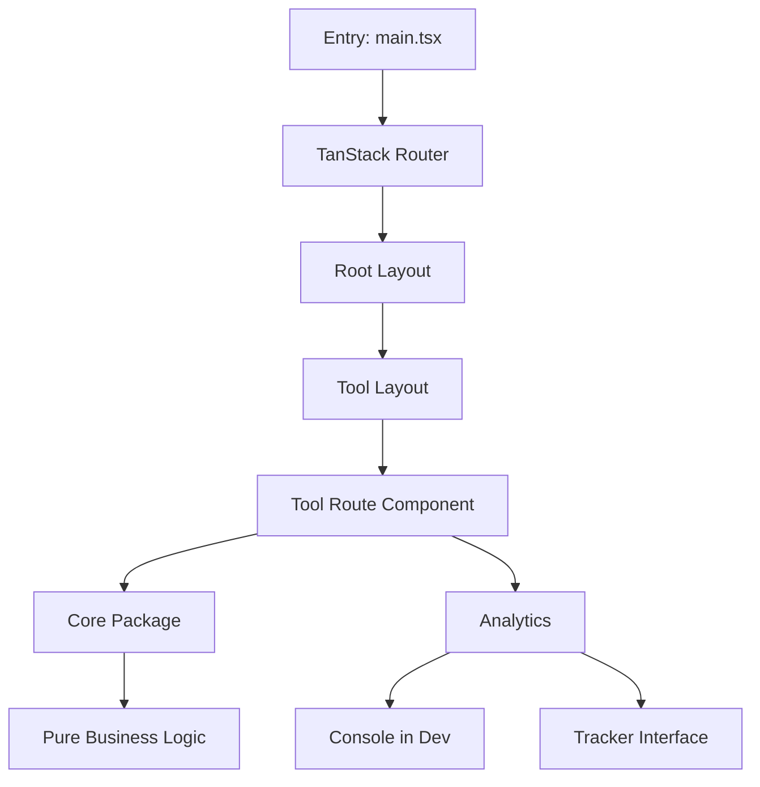

# SPEC.md — Toolbox Platform

## Overview

Toolbox is a unified web platform that hosts multiple focused utility tools under one branded experience. The platform is built as a single-page application using TanStack Router for routing, with business logic co-located alongside route components.

## Architecture

### Repository Structure

```
toolbox/
├── src/
│   ├── routes/           # TanStack Router file-based routes
│   │   └── _tools/       # Individual tool routes
│   └── lib/
│       ├── components/   # Shared UI components
│       ├── analytics/    # Event tracking
│       └── utils/        # Shared utilities
├── public/               # Static assets
└── content/              # MDX content (changelog, etc.)
```

### Core Concepts

#### 1. Route-Based Tool Composition

Each tool lives as a route under `src/routes/_tools/<tool-name>/`. The root layout provides:

- Global navigation sidebar
- Tool-specific headings via `staticData.pageTitle`
- Consistent page structure

#### 2. Core Logic

Business logic is co-located with routes under `src/lib/tools/<tool-name>/`:

- **Pure logic only**: No UI imports, no route-specific state
- **Browser-safe**: No server-only APIs
- **Testable independently**: Can be unit tested without the full app

#### 3. Metadata System

Each route defines its own metadata via `staticData.meta` (with `pageTitle`, `description`, `slug`) and the `head` export. A shared utility in `src/lib/utils/metadata.ts` provides site-level constants (`SITE_NAME`, `SITE_DESCRIPTION`). Tool-specific descriptors are co-located with each route.

#### 4. Analytics Instrumentation

The `src/lib/analytics/` module provides:

- Event tracking (`track`, `page`)
- Tool-specific helpers (`trackToolEntry`, `trackToolCompletion`, `trackAction`)
- Development-mode logging (enable with `VITE_ANALYTICS_DEBUG=true`)
- Extensible tracker interface for future analytics provider integration

### State Management

- **Component-local state**: `useState`/`useRef` for component-level concerns
- **Shareable state**: URL search params via `validateSearch` + Zod (shareable, bookmarkable)
- **Persisted preferences**: `usePersistedState` for localStorage-backed settings

### Design System

Built on:

- **React Aria Components**: Accessible UI primitives
- **Tailwind CSS 4**: Styling via `@theme` tokens
- **Tailwind Variants**: Component-level variant logic

## Data Flow



## Tool Addition Workflow

1. Create route at `src/routes/_tools/<tool-name>/index.tsx`
2. Add `staticData: { meta: { pageTitle, description, slug } }` to the route (navigation auto-discovers routes via `tool-registry.tsx`)
3. Extract business logic to `src/lib/tools/<tool-name>/`
4. Add tool card to homepage catalog in `src/routes/index.tsx`
5. (Optional) Add analytics tracking with `useToolTracking`

See **CONTRIBUTING.md** for detailed instructions.

## Non-Goals

- **SSR**: This is a client-side only (Vite) application.
- **Multi-tenant**: Assumes single organization context.
- **Backend API**: All tools are browser-based with no server dependency.

## Known Limitations

- PWA service worker is disabled by default.
- Auth is not implemented (no user accounts or personalization).
- All tools are client-side only; no data persists across sessions.
