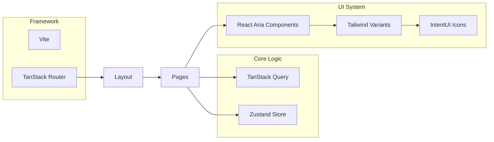

# Intent Dashboard

A premium, high-performance dashboard template built with **React 19**, **TanStack Router**, and **React Aria Components**. Designed for speed, accessibility, and exceptional developer experience.

---

## ✨ Features

- **🚀 React 19 + Vite**: Cutting-edge performance and latest React features.
- **🛣️ TanStack Router**: Fully type-safe routing with data prefetching and auth guards.
- **🎨 Tailwind CSS 4**: Modern styling with native OKLCH support and streamlined `@theme` tokens.
- **♿ Accessible UI**: Built on `react-aria-components` for rock-solid accessibility out of the box.
- **📦 State Management**: Hybrid approach with `Zustand` (client) and `TanStack Query` (server).
- **⚡ PWA Ready**: Optimized for offline use and mobile installation.
- **🛠️ Developer First**: Biome for linting, Turbo for builds, Vitest for testing.

## 🏗️ Architecture Overview

The system is designed as a modular SPA where business logic (Routes) and UI Primitives (Components) are strictly separated.



## 📂 Repository Structure

```text
.
├── src/
│   ├── lib/
│   │   ├── components/       # UI Primitives & Providers
│   │   ├── services/         # API Clients (Ky) & Query Keys
│   │   ├── stores/           # Zustand Auth & Preferences
│   │   ├── styles/           # Tailwind 4 Globals
│   │   └── utils/            # Shared Helper Functions
│   ├── routes/               # File-based Routes (TanStack)
│   │   ├── _private/         # Authenticated Dashboard Area
│   │   └── _restricted/      # Login/Signup Pages
│   └── main.tsx              # App Initialization
├── public/                   # Static Assets & Manifest
├── package.json              # Dependency Manifest
└── biome.json                # Linter & Formatter Config
```

## 🚀 Getting Started

### Prerequisites

- Node.js ^24.11.x
- pnpm@10.24.0

### Installation

```bash
pnpm install
```

### Development

```bash
pnpm dev
```

The application will be available at `http://localhost:3000`.

### Building

```bash
pnpm build
```

### Testing

```bash
pnpm test          # Run all tests
pnpm test:ui       # Run tests with UI
```

## 📖 Related Documentation

- [**SPEC.md**](./SPEC.md) - Deep dive into system specification and data flow.
- [**CONTRIBUTING.md**](./CONTRIBUTING.md) - Guidelines for code style, branching, and PRs.
- [**AGENTS.md**](./AGENTS.md) - Specialized context and guidance for AI coding agents.

## 📄 License

This project is licensed under the MIT License - see the [LICENSE](LICENSE) file for details.
