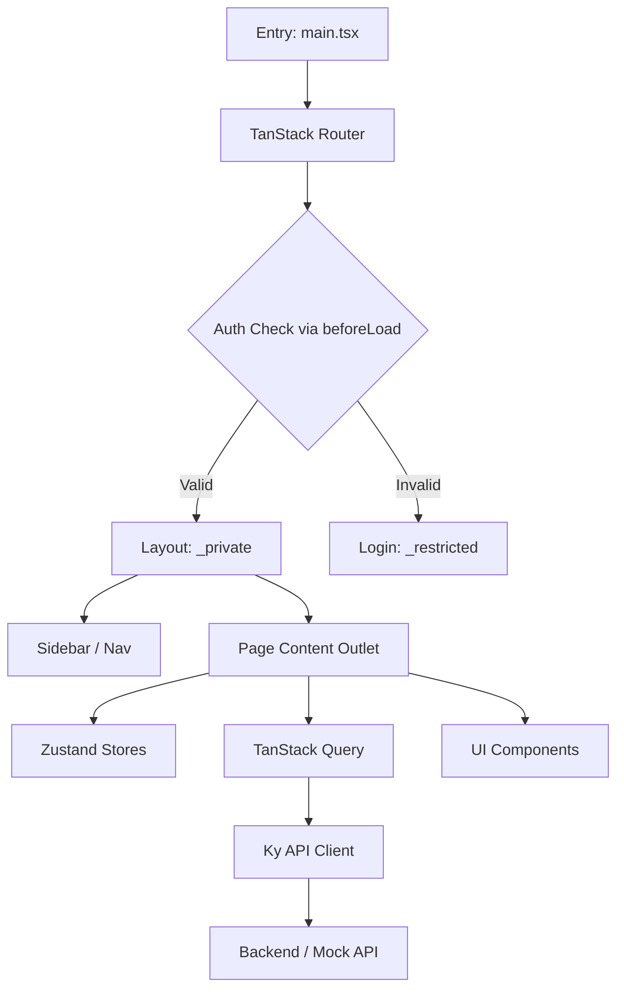
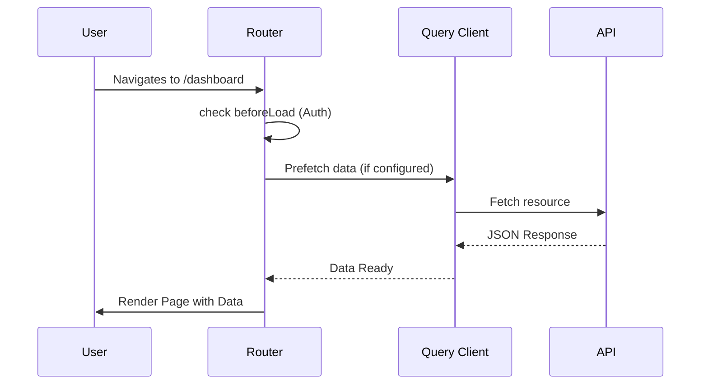

# SPEC.md - System Specification

## Overview

Intent Dashboard is a boilerplate for high-performance administrative and user dashboards. It prioritizes type safety, accessibility, and modern developer experience.

## Core Concepts

### 1. Functional Routing

The application uses **TanStack Router**. Routing is not just for navigation but also for:

- Data prefetching (Loaders).
- Authorization guards (`beforeLoad`).
- Search parameter validation (Zod-integrated).

### 2. Atomic UI Construction

UI components are built using a "Primitives + Variants" pattern:

- **Primitives**: `react-aria-components` (RAC) provide the logic and accessibility.
- **Variants**: `tailwind-variants` manages visual states (hover, pressed, disabled) and design intents (primary, danger, etc.).
- **Consistency**: Components use a shared set of CSS variables (`--primary`, `--bg`, etc.) instead of direct utility classes where possible.

### 3. State Invariants

- **Auth**: The presence of `auth.token` in the router context determines access to `/_private`.
- **Query Cache**: The `QueryClient` is initialized once and passed through the router context to ensure consistency across the component tree.
- **Persistence**: Auth tokens and user preferences (like theme) are persisted in `localStorage` via Zustand middleware.

## Technical Architecture

## Data Lifecycle

## Constraints & Rules

1. **Accessibility (A11y)**: Every interactive element must be keyboard navigable and have appropriate ARIA labels (enforced by `react-aria-components`).
2. **Type Safety**: No `any`. All API responses must have interfaces in `src/lib/services/api/types.ts`.
3. **Styling**: strictly follow the Tailwind 4 `@theme` tokens in `src/lib/styles/globals.css`.
4. **Performance**: Use SPA navigation. Avoid full page reloads.

## Non-Goals

- **Multi-tenant isolation**: This boilerplate assumes a single organization/user context per session.
- **SSR**: This is a client-side only (Vite) application.
- **Heavy state in URL**: Keep search params minimal and validated. Use Zustand for large client-side state.

## Known Limitations

- **Mock Data**: Currently uses static mock data for demos (e.g., `products` in `table-demo.tsx`).
- **Auth Storage**: `localStorage` is used for tokens, which may have security implications in high-security environments (prefer secure cookies if a backend supports it).
